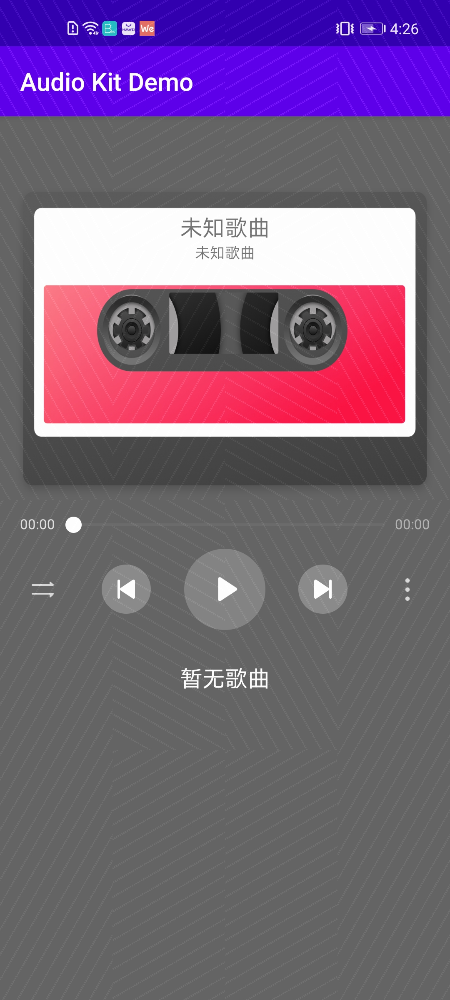
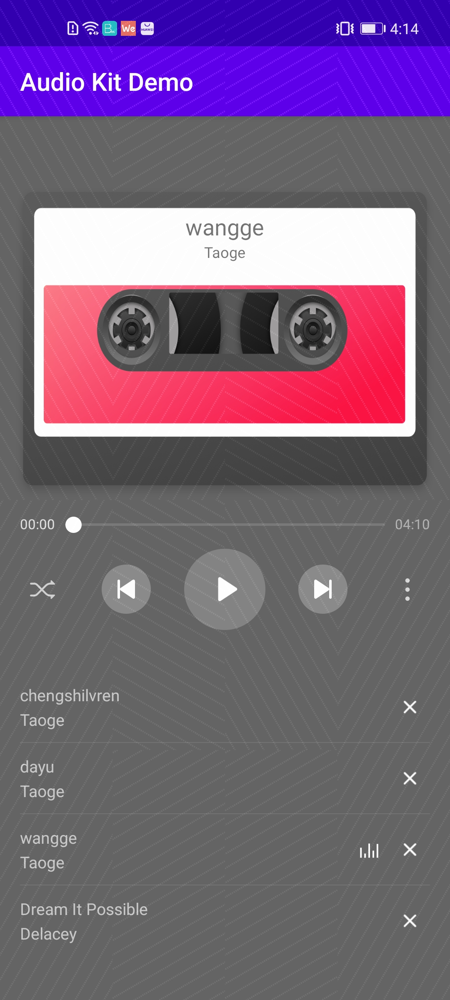

# Audio Kit

## Table of Contents

 * [Introduction](#introduction)
 * [Getting Started](#Getting-Started)
 * [Supported Environments](#supported-environments)
 * [Result](#Result)
 * [License](#license)
 

## Introduction
   AudioKit Android sample code encapsulates APIs of the HUAWEI Audio Kit. It provides many sample programs for your reference or usage.
   The following describes packages of Android sample code.

 HwAudioPlayerManager:Manages playback operations such as play, pause, skip back, skip next, stop, and drag the progress bar.

	
## Getting Started

   1. Check whether the Android studio development environment is ready. Open the sample code project directory with file "build.gradle" in Android Studio. Run TestApp on your divice or simulator which have installed latest Huawei Mobile Service(HMS).
   2. Register a [HUAWEI account](https://developer.huawei.com/consumer/en/).
   3. Create an app and configure the app information in AppGallery Connect. 
   See details: [HUAWEI Audio Service Development Preparation](https://developer.huawei.com/consumer/en/doc/development/HMSCore-Guides/introduction-0000001050749665)
   4. To build this demo, please first import the demo in the Android Studio (3.x+).
   5. Run the sample on your Android device or emulator.
	
	
## Supported Environments
   Android SDK Version >= 21 and JDK version >= 1.7 is recommended.

## Result
   
   

##  License
    AudioKitDemo is licensed under the [Apache License, version 2.0](http://www.apache.org/licenses/LICENSE-2.0).