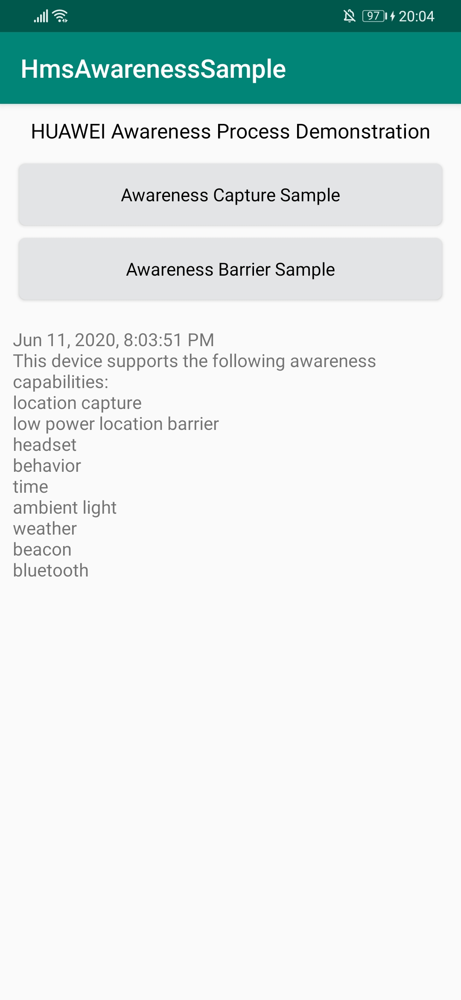
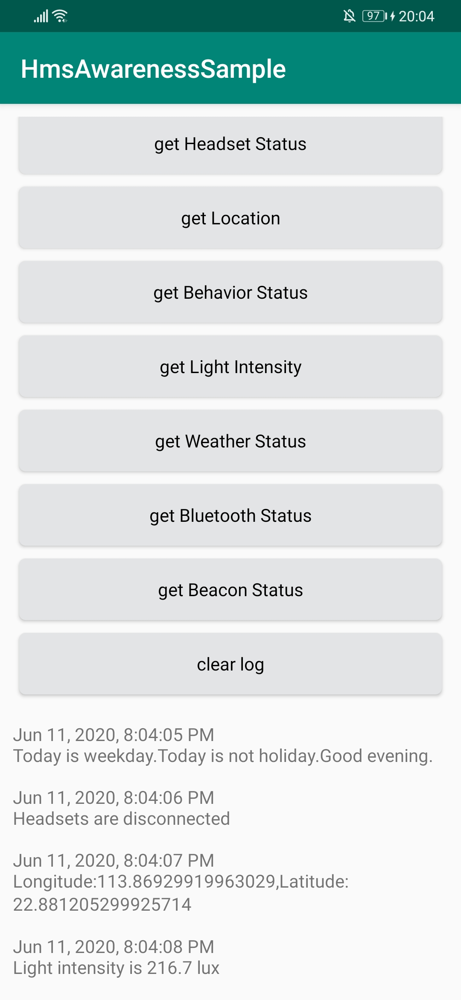

## HUAWEI Awareness Kit Sample Code

## Contents

- [Overview](#overview)
- [Getting Started](#getting-started)
- [Running Environment](#running-environment)
- [Sample Code](#sample-code)
- [Result](#result)
- [License](#license)

## Overview

The sample code shows how to use the Capture API and Barrier API of HUAWEI Awareness Kit for quick integration.

Introduction of HMS Awareness Kit:https://developer.huawei.com/consumer/en/doc/development/HMS-Guides/awareness-introduction

## Getting Started

This sample uses the Gradle build system.

First download the demo by cloning this repository or downloading an archived snapshot.

Check whether the Android studio development environment is ready. Open the sample code project directory with file "build.gradle" in Android Studio. 

To compile and run sample code , you should create an app in AppGallery Connect, change the sample package name to your app package name, and place the agconnect-services.json file and signing certificate under the app directory. For details, please refer to [Preparations](https://developer.huawei.com/consumer/en/doc/development/HMS-Guides/awareness-preparation). 

## Running Environment

Android Studio and JDK 1.8 are used for coding.

Run the app generated by the sample code on the device which have installed Huawei Mobile Service(HMS).

## Sample Code

The HUAWEI Awareness Kit sample code includes Capture and Barrier API sample code.

Capture APIs can be called to obtain the time, headset, location, activity, ambient light, weather, bluetooth car stereo, and beacon status.
Capture APIs allow your app to request the status of a user. For example, the getHeadsetStatus() API can be used to obtain connection status of the headset.

For details about Capture APIs, please visit https://developer.huawei.com/consumer/en/doc/development/HMS-References/awareness-captureclient.

Barrier APIs can be called to implement awareness of the time, headset, location, activity, ambient light, Bluetooth car stereo, and beacon status.
Barrier APIs allow your app to set a series of awareness states. When a user enters a set state, Awareness Kit triggers the corresponding callback to notify the app. For example, the LocationBarrier.enter() API can be used to create a geo-fence.When the user enters the area specified by the geo-fence, Awareness Kit triggers the corresponding callback to notify the app.

For details about Barrier APIs, please visit https://developer.huawei.com/consumer/en/doc/development/HMS-References/awareness-barrier.

Other Awareness Kit API References:https://developer.huawei.com/consumer/en/doc/development/HMS-References/awareness

## Result

## License

HUAWEI Awareness Kit sample is licensed under the [Apache License, version 2.0](http://www.apache.org/licenses/LICENSE-2.0).

