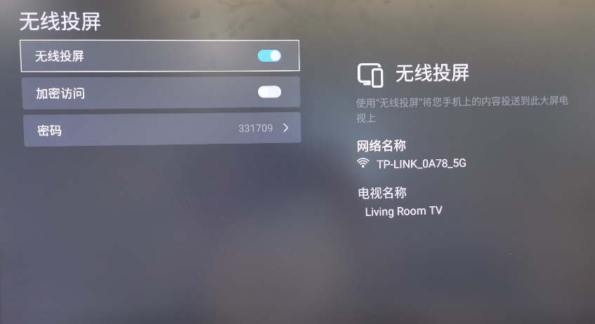

Cast+ Kit Demo
==============================

This project integrates HUAWEI Cast+ Kit capabilities, which enable fast, stable, and low-latency collaboration between mobile 
phones and external display devices, delivering a seamless, cross-device collaborative experience.

Introduction
------------

- [Read more about Cast+ kit](https://developer.huawei.com/consumer/cn/doc/development/connectivity-Guides/castpluskit-introduction)

Getting Started
---------------

- [Add Cast+ kit to your Android Project](https://developer.huawei.com/consumer/cn/doc/development/connectivity-Guides/castpluskit-guide)
- - Run the demo on a display device.

Demo test
---------------------

Compile the APK and run the demo.

Result
-----------

License
-------

Copyright 2016 Huawei.

Licensed to the Apache Software Foundation (ASF) under one or more contributor
license agreements.  See the NOTICE file distributed with this work for
additional information regarding copyright ownership.  The ASF licenses this
file to you under the Apache License, Version 2.0 (the "License"); you may not
use this file except in compliance with the License.  You may obtain a copy of
the License at

  http://www.apache.org/licenses/LICENSE-2.0

Unless required by applicable law or agreed to in writing, software
distributed under the License is distributed on an "AS IS" BASIS, WITHOUT
WARRANTIES OR CONDITIONS OF ANY KIND, either express or implied.  See the
License for the specific language governing permissions and limitations under
the License.
