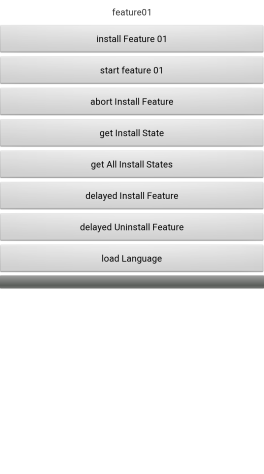

## Dynamic Ability Demo

## Table of Contents

* [Introduction](#introduction)
* [Installation](#installation)
* [Supported Environments](#supported-environments)
* [Sample Code](#Sample-Code)
* [License](#license)

## Introduction
    The Dynamic Ability SDK is a set of solutions for the Huawei AppGallery to dynamically load features by referring to the App Bundle technology. After integrating the Dynamic Ability SDK, third-party applications can download features from the Huawei AppGallery when necessary, thus reducing network traffic and consumption of terminal storage space.
[Read more about Dynamic Ability SDK](https://developer.huawei.com/consumer/cn/doc/development/AppGallery-connect-Guides/agc-featuredelivery-introduction).

## Installation
    Use Android Studio to open the decompressed project.

## Supported Environments
    Hardware requirements:
    1. PC
    2. Huawei mobile phone

    Software requirements:
    1. JDK 1.8 or later
    2. Android API 21 or later
    3. Android Studio 3.2 or later. This cases related to this guide run on Android Studio 3.5.

## Sample-Code
After running the app you should see a screen like this:

##  License
    DynamicAbilitySDK Demo is licensed under the [Apache License, version 2.0](http://www.apache.org/licenses/LICENSE-2.0).

