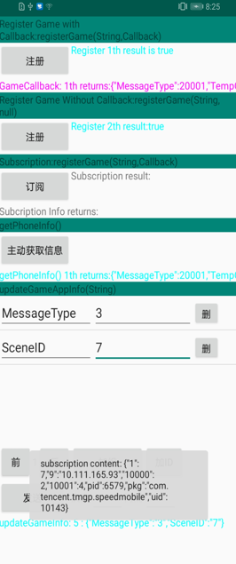
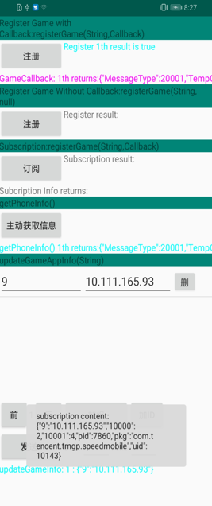

## GameKitDemo

## Table of Contents

- [GameKitDemo](#gamekitdemo)
- [Table of Contents](#table-of-contents)
- [Introduction](#introduction)
- [Installation](#installation)
- [Supported Environments](#supported-environments)
- [Sample-Code](#sample-code)
- [License](#license)

## Introduction
    Game Kit provides refined scene information, configuration information, network information, etc. to the system through the Game App, and the system feeds back system status information to the Game App,
	so Game and system could use this information for closer and deeper collaboration, in the case of limited system resources To further improve the player's gaming experience.

## Installation
    Use DevEco Studio or Android Studio to open the decompressed project.

## Supported Environments
    Hardware requirements:
    1. PC
    2. Huawei mobile phone
	3. EMUI 10.1 or later

    Software requirements:
    1. JDK 1.8 or later
    2. Android API 14 or later
    3. Android Studio 3.2 or later. This cases related to this guide run on Android Studio 3.5.
	4. DevEco Studio 1.0.4.2506&1.0.6.1101 or later.

## Sample-Code
After running the app you should see a screen like this:

##  License
    GameKitDemo is licensed under the [Apache License, version 2.0](http://www.apache.org/licenses/LICENSE-2.0).

