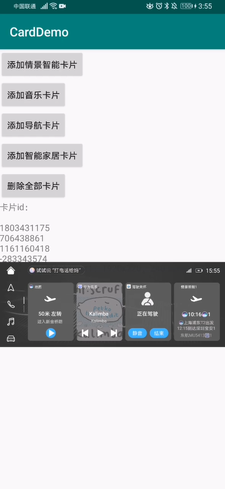

Demo
==============================

本项目集成了HUAWEI HiCar解决方案，以此为用户创造出更佳的智慧出行体验。

简介
------------

- [HiCar相关信息](https://developer.huawei.com/consumer/cn/HiCar)

开始编写
---------------

- [将HiCar能力接入到应用当中](https://developer.huawei.com/consumer/cn/doc/development/HiCar-Guides/32403).
- 在手机运行本demo。

demo测试
---------------------

编译apk，连接车机环境，运行本demo即可。

结果验证
-----------

点击“添加情景智能卡片”“添加音乐卡片”“添加导航卡片”等，如上图所示。

License
-------

Copyright 2016 Huawei.

Licensed to the Apache Software Foundation (ASF) under one or more contributor
license agreements.  See the NOTICE file distributed with this work for
additional information regarding copyright ownership.  The ASF licenses this
file to you under the Apache License, Version 2.0 (the "License"); you may not
use this file except in compliance with the License.  You may obtain a copy of
the License at

  http://www.apache.org/licenses/LICENSE-2.0

Unless required by applicable law or agreed to in writing, software
distributed under the License is distributed on an "AS IS" BASIS, WITHOUT
WARRANTIES OR CONDITIONS OF ANY KIND, either express or implied.  See the
License for the specific language governing permissions and limitations under
the License.
