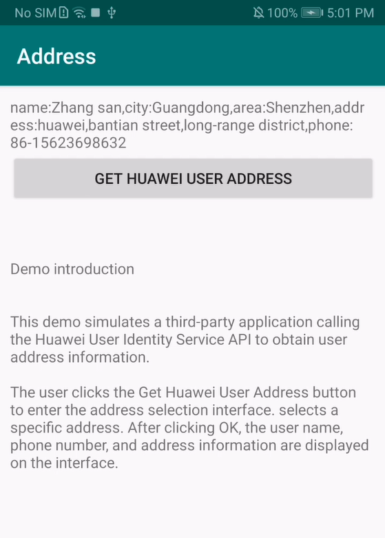

# Huawei Identity Demo

The demo App demonstrates Huawei Identity client APIs and usages. 

Documentation can be found at this 

[link](https://developer.huawei.com/consumer/en/doc/development/HMS-Guides/about-the-service).

## Table Of Content

- [Introduction](#introduction)
- [Enviroment requirement](#enviroment-requirement)
  - [develop requirement](#develop-requirement)
  - [Runtime requirement](#runtime-requirement)
- [Installation](#installation)
- [Configuration](#configuration)
- [Tutorial](#tutorial)
- [Code Examples](#code-examples)
- [License](#license)  

## Introduction

The demo implements the HUAWEI Identity API to obtain the user address interface, and assembles and returns the selected address information to the interface.

## Enviroment requirement

### Develop requirement

To be able to develop, build and debug this demo, you will need at least the following environment:

* a connection to Internet, for downloading package dependencies form Huawei and Google

* a compatible IDE, Android Studio is recommended.

* a gradle installation will be downloaded when you use command line gradle wrapper or 
    open downloaded folder in compatible IDE

* an Android SDK installation, API version 28 or above is recommended.

### Runtime requirement

To be able to run this demo, you will need an Android device with EMUI 5.0 or above, 
Android 4.4 and above, with Huawei Mobile Service (HMS) pre-installed.

If the HMS is missing, the device will prompt you to install or upgrade HMS first on calling Identity SDK.

## Installation

1. Clone or download this project and open the downloaded folder in Android Studio or compatible IDE.

2. use IDE's functionality to install configured project on to your device.

## Configuration

This demo come with pre-configured `agconnect-services.json`, HMS dependencies, signing keys and
in-app products. These pre-configured settings are for demo purpose only, please refer to the 
[Documentation](https://developer.huawei.com/consumer/en/doc/development/HMS-Guides/about-the-service)
for guide of adopting Huawei Identity.

## Tutorial

1. Once you start the demo, you should be able to see the following page.

2. Click to **get Huawei User Address** button. After selecting the specific address, click OK. The following result will be displayed.

## Code Examples

### Obtaining a User Address

1. Instantiate the request object by using the **new UserAddressRequest** method. Then, call the **getUserAdddress** API.
   The code location is in the getUserAddress method in the src/app/src/main/java/com/huawei/demo/identitydemo/MainActivity.java file.

2. Display the address selection page by calling the **startActivityResult** method of **Status**.
   The code location is in the startActivityForResult method in the src/app/src/main/java/com/huawei/demo/identitydemo/MainActivity.java file.

3. After the user selects an address, call the **parseIntent** method of **UserAddress** in **onActivityResult** of the page and obtain the address from the returned result.
   The code location is in the onActivityResult method in the src/app/src/main/java/com/huawei/demo/identitydemo/MainActivity.java file.

## License

This demo is licensed under the [Apache License, version 2.0](http://www.apache.org/licenses/LICENSE-2.0).
