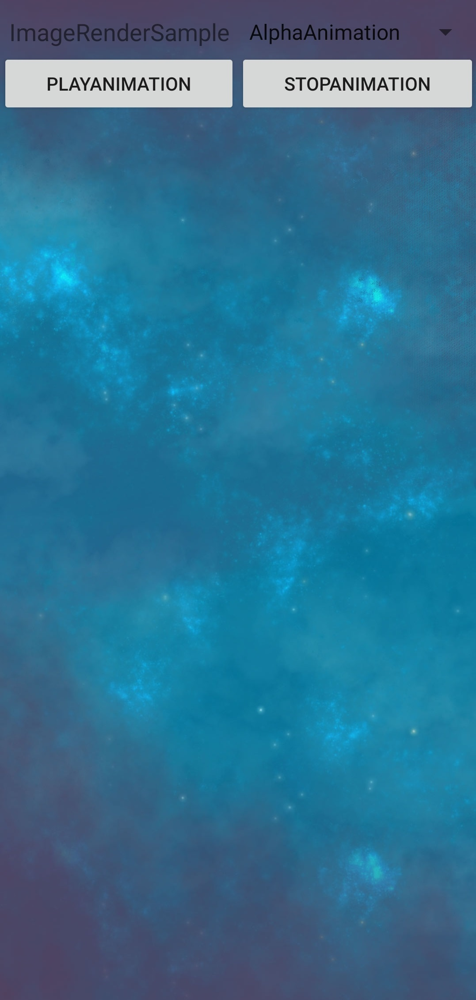

## image-render-sample

## Table of Contents

 * [Introduction](#introduction)
 * [Getting Started](#Getting-Started)
 * [Supported Environments](#supported-environments)
 * [Result](#result)
 * [License](#license)

## Introduction
The Image Render service provides basic and advanced animation effects to help you reproduce image contents in an efficient way.

1. Supports five basic animations and any of their combination.

2. Provides nine advanced animation effects, bringing more fun to user interactions.

For details, please refer to [XML Syntax Specifications for Image Render](https://developer.huawei.com/consumer/en/doc/development/HMSCore-Guides/xml-introduction-0000001050439245).

## Getting Started
1. Check whether the Android studio development environment is ready. Open the sample code project directory with file "build.gradle" in Android Studio. Run TestApp on your divice or simulator which have installed latest Huawei Mobile Service(HMS).
2. Register a [HUAWEI account](https://developer.huawei.com/consumer/en/).
3. Create an app and configure the app information in AppGallery Connect. 
   See details: [HUAWEI Image Service Development Preparation](https://developer.huawei.com/consumer/en/doc/development/HMSCore-Guides/config-agc-0000001050199019)
4. To build this demo, please first import the demo in the Android Studio (3.x+).
5. Run the sample on your Android device or emulator.

## Supported Environments
- Android Studio 3.0 or later. 

- Java SDK 1.8 or later.

- Android SDK version is 26 or later.

- Gradle 3.3.2.

- HMS Core (APK) 4.0.2.300 or later.

## Result

   

##  License

ImageRenderSample is licensed under the [Apache License, version 2.0](http://www.apache.org/licenses/LICENSE-2.0).

