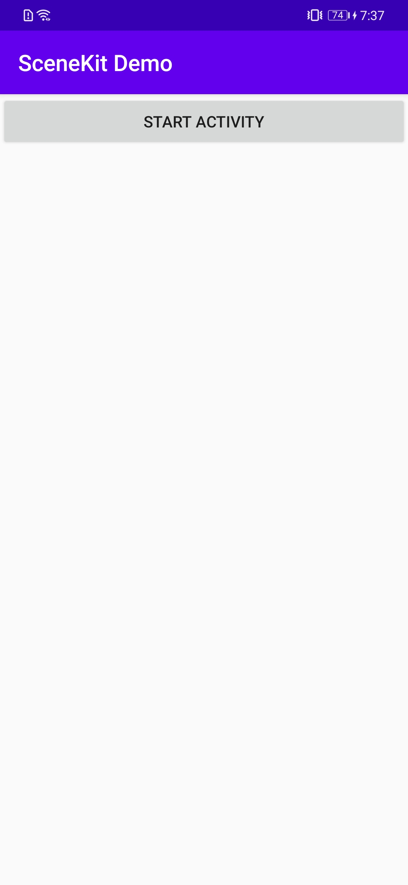
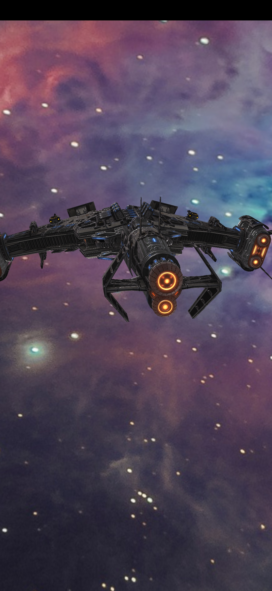
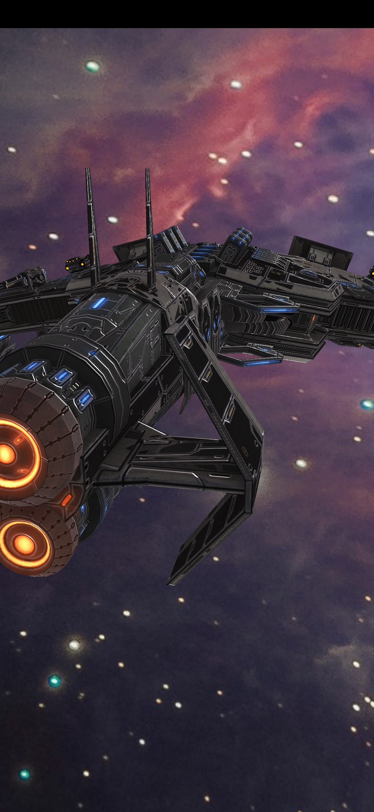

# SceneKitDemo

## Table of Contents

* [Introduction](#Introduction)
* [Getting Started](#Getting-Started)
* [Supported Environments](#Supported-Environments)
* [Result](#Result)
* [License](#License)

## Introduction

The SceneKitDemo app demonstrates a sample to call the SceneView.

[Read more about HUAWEI Scene Kit](<https://developer.huawei.com/consumer/en/hms/huawei-scenekit>).

## Getting-Started

   1. Check whether the Android studio development environment is ready. Open the sample code project directory with file "build.gradle" in Android Studio. Run SceneKitDemo on your divice or simulator which have installed latest Huawei Mobile Service(HMS).
   2. Register a [HUAWEI account](https://developer.huawei.com/consumer).
   3. Create an app and configure the app information in AppGallery Connect.
   See details: [HUAWEI Scene Kit Development Preparation](<https://developer.huawei.com/consumer/en/doc/development/HMSCore-Guides/dev-process-0000001050195424>)
   4. To build this demo, please first import the demo in the Android Studio (3.5+).
   5. Run the sample on your Android device or emulator.

## Supported-Environments

* AndroidStuido 3.5.0 or a later version is recommended.
* JDK 1.7 or later.
* HMS Core (APK) 4.0.2.300 or later.
* Android 8.0 or later.

## Result

   
   
   
   

## License

SceneKitDemo is licensed under the [Apache License, version 2.0](http://www.apache.org/licenses/LICENSE-2.0).

3D model 'Mjolnir' published by Star Conflict under the [Creative Commons Attribution license](https://creativecommons.org/licenses/by/4.0/legalcode).

Learn more about [Mjolnir](<https://sketchfab.com/3d-models/mjolnir-c8e9020d658649238ee3cfc1c1d64a68>).
